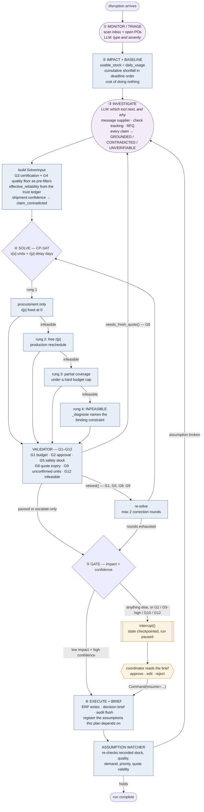

# Agent workflow

Detection through execution, with the replan loop. Rectangles are
deterministic code, rounded nodes involve the model, the diamond is the human
checkpoint.

## The loops, and why each exists

**Validator → re-solve.** A guardrail veto sends the plan back to the solver,
at most twice, then escalates. The model does not get to overrule the
validator; a constraint you ask a model to respect is a suggestion.

**G8 → node ③, not the solver.** An expired quote is stale information, not a
bad plan. Re-solving the same inputs drops that supplier for the rest of the
run when the remedy is one RFQ away, so `needs_fresh_quote()` routes it back
to investigation for a fresh quote first. This is the one veto whose fix is
not a re-solve.

**Assumption broken → node ③.** Every plan records the facts it depends on —
a quote's validity window, a stock figure, a priority. When the environment
changes one, the watcher invalidates it and the graph re-enters investigation
carrying `broken_assumption`. Replanning is then deterministic and visible,
rather than something the model might or might not notice.

**Escalation resumes, it does not restart.** `interrupt()` checkpoints the
full state. `Command(resume=…)` picks up from the pause with everything the
run had already learned — the tool results, the verifications, the trust
updates — rather than starting again.
